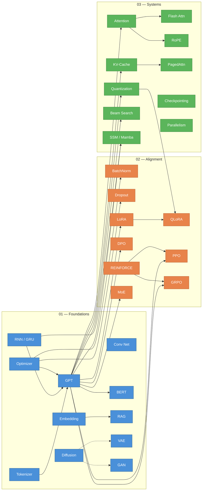

[](https://github.com/Mathews-Tom/no-magic)

---


---

# no-magic

**Because `model.fit()` isn't an explanation.**

<video src="https://github.com/user-attachments/assets/b42b3b7b-6cc0-404a-a7ba-86a193a181a5" width="100%" autoplay loop muted playsinline></video>

---

## What This Is

`no-magic` is a curated collection of single-file, dependency-free Python implementations of the algorithms that power modern AI. Each script is a complete, runnable program that trains a model from scratch and performs inference — no frameworks, no abstractions, no hidden complexity.

Every script in this repository is an **executable proof** that these algorithms are simpler than the industry makes them seem. The goal is not to replace PyTorch or TensorFlow — it's to make you dangerous enough to understand what they're doing underneath.

## See It In Action

<table>
<tr>
<td align="center"><b>Attention Mechanism</b><br/>
<br/>
<sub>Q·K<sup>T</sup> → softmax → weighted V</sub></td>
<td align="center"><b>Autoregressive GPT</b><br/>
<br/>
<sub>Token-by-token generation</sub></td>
<td align="center"><b>LoRA Fine-tuning</b><br/>
<br/>
<sub>Low-rank weight injection</sub></td>
</tr>
<tr>
<td align="center"><b>Word Embeddings</b><br/>
<br/>
<sub>Contrastive learning → semantic clusters</sub></td>
<td align="center"><b>DPO Alignment</b><br/>
<br/>
<sub>Preferred vs. rejected → policy update</sub></td>
<td align="center"><b>RAG Pipeline</b><br/>
<br/>
<sub>Retrieve → augment → generate</sub></td>
</tr>
<tr>
<td align="center"><b>Flash Attention</b><br/>
<br/>
<sub>Tiled O(N) memory computation</sub></td>
<td align="center"><b>Quantization</b><br/>
<br/>
<sub>Float32 → Int8 = 4x compression</sub></td>
<td align="center"><b>Mixture of Experts</b><br/>
<br/>
<sub>Sparse routing to specialist MLPs</sub></td>
</tr>
<tr>
<td align="center"><b>BPE Tokenizer</b><br/>
<br/>
<sub>Iterative pair merging → vocabulary</sub></td>
<td align="center"><b>BERT</b><br/>
<br/>
<sub>Bidirectional attention + [MASK] prediction</sub></td>
<td align="center"><b>KV-Cache</b><br/>
<br/>
<sub>Memoize keys/values — stop recomputing</sub></td>
</tr>
<tr>
<td align="center"><b>Beam Search</b><br/>
<br/>
<sub>Tree search with top-k pruning</sub></td>
<td align="center"><b>RoPE</b><br/>
<br/>
<sub>Position via rotation matrices</sub></td>
<td align="center"><b>PPO (RLHF)</b><br/>
<br/>
<sub>Clipped policy gradient for alignment</sub></td>
</tr>
<tr>
<td align="center"><b>State Space Models</b><br/>
<br/>
<sub>Linear-time selective state transitions</sub></td>
<td align="center"><b>Convolutional Net</b><br/>
<br/>
<sub>Sliding kernels → feature maps</sub></td>
<td align="center"><b>Diffusion</b><br/>
<br/>
<sub>Noise → data via iterative denoising</sub></td>
</tr>
<tr>
<td align="center"><b>GAN</b><br/>
<br/>
<sub>Generator vs discriminator minimax</sub></td>
<td align="center"><b>VAE</b><br/>
<br/>
<sub>Encode → sample z → decode</sub></td>
<td align="center"><b>RNN vs GRU</b><br/>
<br/>
<sub>Vanishing gradients and gating</sub></td>
</tr>
<tr>
<td align="center"><b>Optimizers</b><br/>
<br/>
<sub>SGD vs Momentum vs Adam convergence</sub></td>
<td align="center"><b>Batch Normalization</b><br/>
<br/>
<sub>Normalize activations → stable training</sub></td>
<td align="center"><b>Dropout</b><br/>
<br/>
<sub>Kill neurons → prevent overfitting</sub></td>
</tr>
<tr>
<td align="center"><b>QLoRA</b><br/>
<br/>
<sub>4-bit base + full-precision adapters</sub></td>
<td align="center"><b>GRPO</b><br/>
<br/>
<sub>Group-relative rewards, no critic</sub></td>
<td align="center"><b>REINFORCE</b><br/>
<br/>
<sub>Log P(a) × reward = gradient</sub></td>
</tr>
<tr>
<td align="center"><b>Checkpointing</b><br/>
<br/>
<sub>O(n) → O(√n) memory via recompute</sub></td>
<td align="center"><b>PagedAttention</b><br/>
<br/>
<sub>OS-style paged KV-cache memory</sub></td>
<td align="center"><b>Model Parallelism</b><br/>
<br/>
<sub>Tensor + pipeline across devices</sub></td>
</tr>
</table>

> All 30 algorithms have animated visualizations. Full 1080p60 videos in [Releases](https://github.com/Mathews-Tom/no-magic/releases).
> Video source scenes in [`videos/scenes/`](videos/scenes/) — built with [Manim](https://www.manim.community/).

### Rendering Videos Locally

All visualizations can be rendered from source. System dependencies: `cairo`, `pango`, `ffmpeg`, and optionally `gifsicle` for GIF optimization.

```bash
# Install Manim (one-time)
pip install -r videos/requirements.txt

# macOS system deps (one-time)
brew install cairo pango ffmpeg gifsicle

# Ubuntu/Debian system deps (one-time)
sudo apt-get install -y libcairo2-dev libpango1.0-dev ffmpeg gifsicle
```

**Using the Python renderer** (`render_all.py`):

```bash
# Render all 30 scenes — full 1080p60 MP4 + 480p GIF previews
python videos/render_all.py

# Render specific scenes only
python videos/render_all.py microattention microgpt microlora

# Full MP4s only (no GIFs)
python videos/render_all.py --full-only

# GIF previews only (faster)
python videos/render_all.py --preview-only

# Custom quality (low/medium/high/4k)
python videos/render_all.py --quality medium

# Skip GIF optimization step
python videos/render_all.py --preview-only --skip-optimize
```

**Using the shell renderer** (`render.sh`):

```bash
bash videos/render.sh                    # all scenes (MP4 + GIF)
bash videos/render.sh microattention     # single scene
bash videos/render.sh --preview-only     # GIF previews only
bash videos/render.sh --full-only        # MP4s only
```

Output lands in `videos/renders/` (MP4) and `videos/previews/` (GIF). Full rendering details in [`videos/README.md`](videos/README.md).

## Philosophy

Modern ML education has a gap. There are thousands of tutorials that teach you to call library functions, and there are academic papers full of notation. What's missing is the middle layer: **the algorithm itself, expressed as readable code**.

This project follows a strict set of constraints:

- **One file, one algorithm.** Every script is completely self-contained. No imports from local modules, no `utils.py`, no shared libraries.
- **Zero external dependencies.** Only Python's standard library. If it needs `pip install`, it doesn't belong here.
- **Train and infer.** Every script includes both the learning loop and generation/prediction. You see the full lifecycle.
- **Runs in minutes on a CPU.** No GPU required. No cloud credits. Every script completes on a laptop in reasonable time.
- **Comments are mandatory, not decorative.** Every script must be readable as a guided walkthrough of the algorithm. We are not optimizing for line count — we are optimizing for understanding. See `CONTRIBUTING.md` for the full commenting standard.

## Who This Is For

- **ML engineers** who use frameworks daily but want to understand the internals they rely on.
- **Students** transitioning from theory to practice who want to see algorithms as working code, not just equations.
- **Career switchers** entering ML who need intuition for what's actually happening when they call high-level APIs.
- **Researchers** who want minimal reference implementations to prototype ideas without framework overhead.
- **Anyone** who has ever stared at a library call and thought: _"but what is it actually doing?"_

This is not a beginner's introduction to programming. You should be comfortable reading Python and have at least a surface-level familiarity with ML concepts. The scripts will give you the depth.

## What You'll Find Here

The repository is organized into three tiers based on conceptual dependency:

### 01 — Foundations (11 scripts)

Core algorithms that form the building blocks of modern AI systems. GPT, RNN, BERT, CNN, GAN, VAE, diffusion, embeddings, tokenization, RAG, and optimizer comparison.

See [`01-foundations/README.md`](01-foundations/README.md) for the full algorithm list, timing data, and roadmap.

### 02 — Alignment & Training Techniques (9 scripts)

Methods for steering, fine-tuning, and aligning models after pretraining. LoRA, QLoRA, DPO, PPO, GRPO, REINFORCE, MoE, batch normalization, and dropout/regularization.

See [`02-alignment/README.md`](02-alignment/README.md) for the full algorithm list, timing data, and roadmap.

### 03 — Systems & Inference (10 scripts)

The engineering that makes models fast, small, and deployable. Attention variants, Flash Attention, KV-cache, PagedAttention, RoPE, quantization, beam search, checkpointing, parallelism, and SSMs.

See [`03-systems/README.md`](03-systems/README.md) for the full algorithm list, timing data, and roadmap.

## How to Use This Repo

```bash
# Clone the repository
git clone https://github.com/Mathews-Tom/no-magic.git
cd no-magic

# Pick any script and run it
python 01-foundations/microgpt.py
```

That's it. No virtual environments, no dependency installation, no configuration. Each script will download any small datasets it needs on first run.

### Minimum Requirements

- Python 3.10+
- 8 GB RAM
- Any modern CPU (2019-era or newer)

### Quick Start Path

If you're working through the scripts systematically, this subset builds core concepts incrementally:

```text
microtokenizer.py     → How text becomes numbers
microembedding.py     → How meaning becomes geometry
microgpt.py           → How sequences become predictions
microbert.py          → How bidirectional context differs from autoregressive
microbatchnorm.py     → How normalizing activations stabilizes training
microlora.py          → How fine-tuning works efficiently
microdpo.py           → How preference alignment works
microattention.py     → How attention actually works (all variants)
microrope.py          → How position gets encoded through rotation
microquant.py         → How models get compressed
microflash.py         → How attention gets fast
microssm.py           → How Mamba models bypass attention entirely
```

Each tier's README has the full algorithm list with measured run times for that category.

## Dependency Graph

How the algorithms connect conceptually. Arrows mean "understanding A helps with B" — not code imports (every script is fully self-contained).



**Legend:** <span style="color:#4a90d9">Foundations</span> · <span style="color:#e8834a">Alignment</span> · <span style="color:#5bb55b">Systems</span> — Solid arrows = strong prerequisite, dashed arrows = conceptual comparison.

## Inspiration & Attribution

This project is directly inspired by [Andrej Karpathy's](https://github.com/karpathy) extraordinary work on minimal implementations — particularly [micrograd](https://github.com/karpathy/micrograd), [makemore](https://github.com/karpathy/makemore), and the `microgpt.py` script that demonstrated the entire GPT algorithm in a single dependency-free Python file.

Karpathy proved that there's enormous demand for "the algorithm, naked." `no-magic` extends that philosophy across the full landscape of modern AI/ML.

## How This Was Built

In the spirit of transparency: the code in this repository was co-authored with Claude (Anthropic). I designed the project — which algorithms to include, the three-tier structure, the constraint system, the learning path, and how each script should be organized — then directed the implementations and verified that every script trains and infers correctly end-to-end on CPU.

I'm not claiming to have hand-typed every algorithm from scratch. The value of this project is in the curation, the architectural decisions, and the fact that every script works as a self-contained, runnable learning resource. The line-by-line code generation was collaborative.

This is how I build in 2026. I'd rather be upfront about it.

## Contributing

Contributions are welcome, but the constraints are non-negotiable. See `CONTRIBUTING.md` for the full guidelines. The short version:

- One file. Zero dependencies. Trains and infers.
- If your PR adds a `requirements.txt`, it will be closed.
- Quality over quantity. Each script should be the **best possible** minimal implementation of its algorithm.

## License

MIT — use these however you want. Learn from them, teach with them, build on them.

---

_The constraint is the product. Everything else is just efficiency._
